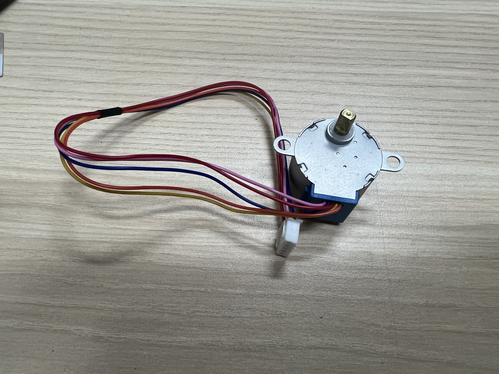
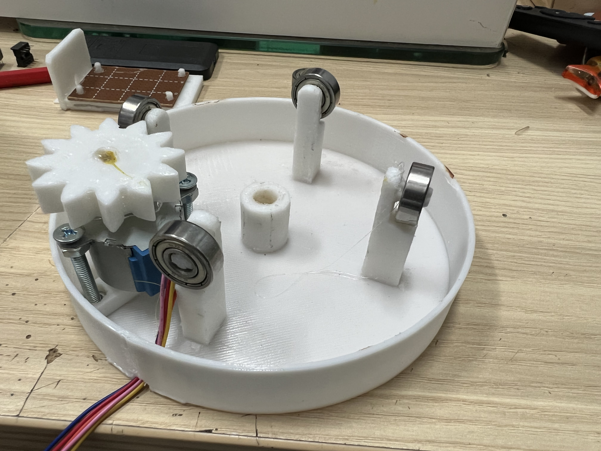
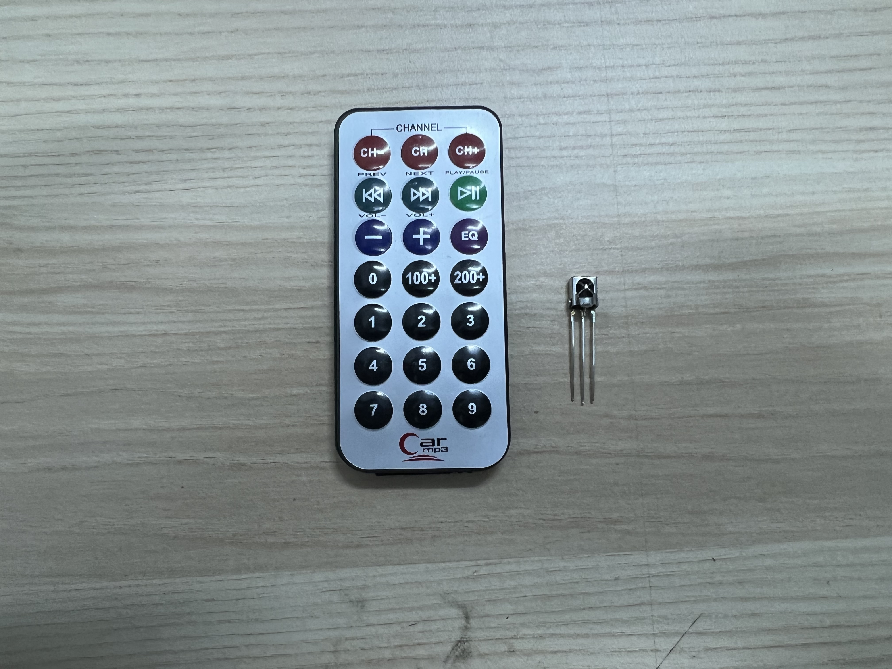
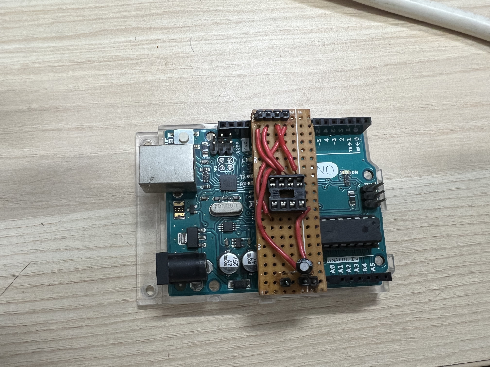
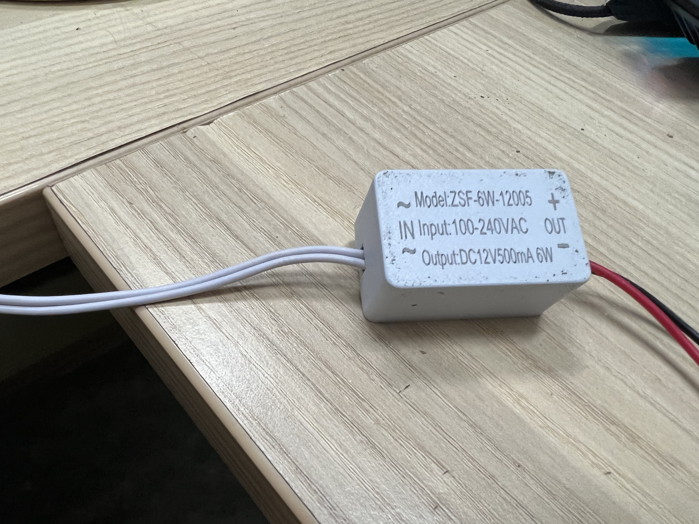
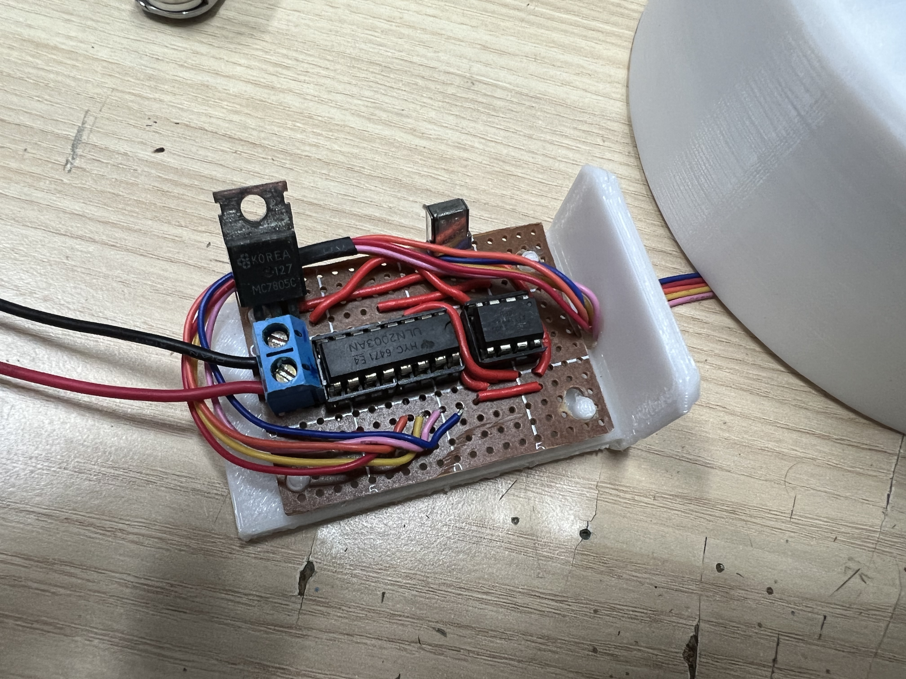
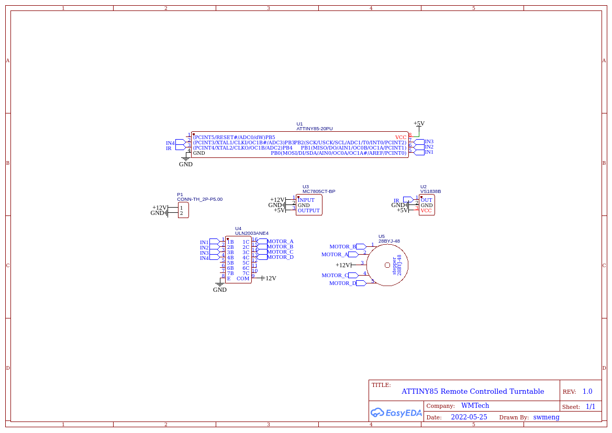

# ATTINY85 Remote Controlled Turntable

This is a turntable modified from [FalcoV's design](https://www.thingiverse.com/thing:2099382).

## Journey
At first, I thought of making a motorised turntable, so I went searching on Thingiverse and found FalcoV's design. However, I do not have the geared brushed motor with me, so I wanted to try using these 28BYJ-48 stepper motors. 
They can be driven with a ULN2003 Darlington transistor array. For more information about driving this stepper motor, refer [here](https://create.arduino.cc/projecthub/debanshudas23/getting-started-with-stepper-motor-28byj-48-3de8c9). To fit the gear into the stepper motor, I modified the gear a little. 

*Please note that 606 bearings are needed instead of 608 as stated in FalcoV's design.

After that, I thought that it will be cool to make it remote-controlled. Thus I went with the IR Remote approach. I used these cheap IR receivers and remote controls.

For the circuit, as the whole project only requires 4 I/O pins in total, it would be a waste to use an ATMEGA328 based microcontroller, thus I searched around and found a ATTINY85 with me. It has a total of 4 usable I/O pins which is just enough for this project.

For more info about programming the ATTINY85 with an arduino, visit [here](https://circuitdigest.com/microcontroller-projects/programming-attiny85-microcontroller-ic-using-arduino).
I made a hat for the arduino uno for this.

The schematic of the circuit is given [below](#schematic).

The circuit is powered by a cheap 12V power supply (used to power led strips).
Here's the finished circuit.

## Schematic

## Completed Project
<iframe src="https://drive.google.com/file/d/1A5O9XK1z3PkgxU5nkv2c31mZUUX6Bg0R/preview" width="100%" allow="autoplay"></iframe>